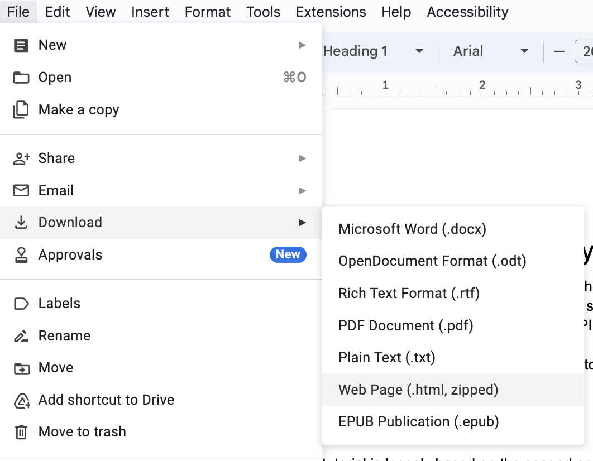
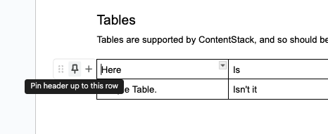

# Doc-to-Markdown

This is a small command-line utility for converting Google Docs documents to
Markdown that's suitable for pasting into ContentStack.

## What does it actually do?

`doc2md` can convert HTML exported from Google Docs into clean Markdown documents for pasting into ContentStack, with the following features:

- Code!
  - Firstly, the script will identify any code blocks (formatted using Fira Code, Roboto Mono, Source Code Pro, or Courier New) and will mark them as code blocks in the resulting Markdown.
  - Some basic heuristics are used to annotate code blocks as python code
  - Inline code can be correctly identified using backticks (the same as Markdown itself) or formatting (any spans marked with a code font).
- Empty paragraphs are removed
- Hyperlinks are correctly extracted from Google's nasty tracking links.
- Bold and italic formatting is maintained where possible.
- Supports tables!

## Not (currently) Supported

- Currently, code blocks obtained by "Insert > Building blocks > Code block" are converted very badly.  [#1](https://github.com/judy2k/doc-to-md/issues/1)
- Images - I can't currently think of a good way to make image upload into ContentStack more seamless, without API access to ContentStack itself. 
- See the [To Do](#to-do) section.

## Installation

```
brew install pandoc    # <- MacOS or Linuxbrew
# apt install pandoc   # <- Debian/Ubuntu
# choco install pandoc # <- Windows with Chocolatey
# ... or see here for more instructions: https://pandoc.org/installing.html

python -m pip install --upgrade git+https://github.com/judy2k/doc-to-md.git

# Check that it worked:
doc2md --help
```

## Usage

The tool doesn't have many options, so using it is relatively straightforward.

First, download your Google Doc as a Web Page.



Unzip the archive, and then in the command-line, run something like the following:

```
# Create a new Markdown file from an existing Google Docs HTML file:
doc2md /PATH/TO/INPUT.HTML /PATH/TO/OUTPUT.MD
```

This should produce a clean, formatted Markdown file, suitable for copying into ContentStack.
You will, sadly, still have to import all your images and insert them in the correct locations yourself.

### Tables

Tables are supported by doc2md, and are exported to GFM table format.
This hasn't been _widely_ tested.

If your table doesn't have a header row, then a blank one will be inserted,
which is probably not what you want.
To mark a header row in Google Docs,
hover over the row and click on the pin icon that appears to the left.



## To-Do
- Improve the code that identifies and merges code blocks. ([#3](https://github.com/judy2k/doc-to-md/issues/3)).
- Use [pypandoc_binary](https://pypi.org/project/pypandoc-binary/) to make it easier to install.
- ContentStack doesn't support `--` and `---` so replace them (outside of code blocks!) with n-dash and m-dash characters.
- Resulting Markdown occasionally includes a backslash followed by line-break character. Need to identify why it's happening and fix.
- Is there a way to manage images better?
- Can captions in the doc automatically be applied to the associated image?
- Ensure backticks aren't messed up inside code blocks.

--------
Made with 💚 for my colleagues at MongoDB, by Judy2k.