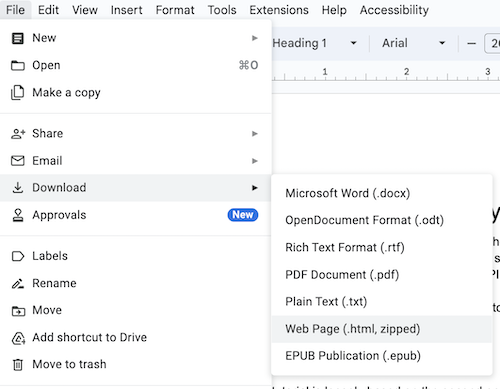

# Doc-to-Markdown

This is a small command-line utility for converting Google Docs documents to
Markdown that's suitable for pasting into ContentStack.

## What does it actually do?

Firstly, the script will identify any code blocks (formatted using Fira Code)
and will identify them as code blocks in the resulting Markdown.

- Empty paragraphs are removed
- Some basic heuristics are used to annotate code blocks as python code
- Hyperlinks are correctly extracted from Google's nasty tracking links.
- Inline code can be correctly identified using backticks (the same as Markdown itself).

# Installation

```
# These assume you are running a Mac:
brew install pandoc

pip install REPO-HERE-SOON
```

# Usage

The tool doesn't have many options, so using it is relatively straightforward.

First, download your Google Doc as a Web Page.



Unzip the archive, and then in the command-line, run something like the following:

```
doc2md /PATH/TO/INPUT.HTML /PATH/TO/OUTPUT.MD
```

This should produce a nice, clean, formatted Markdown file, suitable for copying into ContentStack.
You will, sadly, still have to import all your images and insert them in the correct locations yourself.

# To-Do

- Identify inline code from formatting, as well as backticks.
- Is there a way to manage images better?
- Can captions in the doc automatically be applied to the associated image?
- Ensure bold and italic formatting is maintained where possible.
- Replace ndash in code with --
- Handle -- (ndash) and --- (mdash) in resulting Markdown. Are these supported by ContentStack?